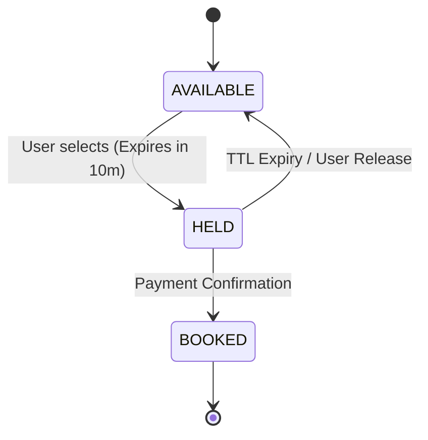

# Professional Movie Seat Booking Backend

A high-concurrency backend system designed to manage movie show seats with atomic state transitions and robust failure recovery.

> [!IMPORTANT]
> **Scope Framing**: This is a backend-only engineering task. The included frontend dashboard is strictly for visual demonstration and manual testing. The core value of this submission lies in the backend seat management logic and concurrency protection.

## 🛠 Technical Core: Seat State Machine

The system manages seat availability using a strict finite state machine to ensure data integrity and prevent double-selling.

### Key Logic Principles
- **Hold TTL**: Every seat hold has a 10-minute Time-To-Live (TTL). Availability calculations dynamically include expired holds to ensure immediate inventory recovery.
- **Atomic Transitions**: Every status change is wrapped in a `transaction.atomic()` block.
- **Concurrency Control**: Robust protection using **Row-Level Locking** (`select_for_update`) prevents race conditions when hundreds of users attempt to book the same seat simultaneously.
- **Idempotency**: Booking requests are idempotent. If a user retries a request, the system verifies the existing hold/booking state to prevent duplicate operations.

---

## 🛡 Failure Handling & Resilience

Designed for real-world instability, the system handles the following scenarios:

| Scenario | Solution |
| :--- | :--- |
| **Server Crash during Hold** | Expiry timestamps are persisted in the DB. System remains consistent upon restart. |
| **Dropped Responses** | Client-side retries are handled via idempotent backend checks. |
| **Concurrent Booking** | Database-level locking prevents race conditions; only one request succeeds. |
| **Interrupted Payments** | The 10-minute TTL ensures that "abandoned" holds automatically return to the available pool. |

---

## 🚀 API Documentation

The backend exposes a RESTful API for seamless integration.

### Main Endpoints

#### `GET /api/seats/?show_id={id}`
Returns the current status of all seats for a show, including real-time availability statistics.
- **Answered**: Available count, Held count, Booked count.

#### `POST /api/seats/hold-batch/`
Temporarily reserves a set of seats for 10 minutes.
- **Payload**: `{"show_id": 1, "seats": [{"row": "A", "number": 1}]}`

#### `POST /api/seats/book-batch/`
Finalizes the booking of currently held seats.
- **Payload**: `{"show_id": 1, "seats": [{"row": "A", "number": 1}]}`

#### `POST /api/seats/release-hold-batch/`
Explicitly releases a set of held seats back to the available pool.
- **Payload**: `{"show_id": 1, "seats": [{"row": "A", "number": 1}]}`

---

## ⚡ Setup & Verification

1. **Install Dependencies**: `pip install -r requirements.txt`
2. **Setup Database**: 
   - `python manage.py migrate`
   - `python manage.py seed_data` (Seeds theatre data and a demo user)
3. **Run Server**: `python manage.py runserver`
4. **Run Tests**: `python manage.py test seats` (Verify atomic state transitions)
5. **Stress Test**: `python stress_test.py` (Verify concurrency protection)

---

## 📺 Testing Utility (Frontend)
Accessible at `http://127.0.0.1:8000/`. Use this dashboard to visually confirm the backend's real-time state transitions and activity logging during your review.

---

## 🌐 Deployment

This application is production-ready and can be deployed to various platforms:

### Quick Deploy Options:
- **Render** (Recommended - Free tier available)
- **Railway** (Fast deployments)
- **Heroku** (Classic PaaS)

### Production Features:
- ✅ PostgreSQL database support
- ✅ Whitenoise for static file serving
- ✅ Environment-based configuration
- ✅ Security settings for production
- ✅ Gunicorn WSGI server
- ✅ Automatic migrations on deploy

---

## 🏆 Key Features

- ✅ **Atomic State Machine** - AVAILABLE → HELD → BOOKED transitions
- ✅ **Row-Level Locking** - Prevents race conditions
- ✅ **10-Minute Hold TTL** - Automatic expiry
- ✅ **Concurrent Booking Protection** - Verified with stress tests
- ✅ **Production Ready** - Complete deployment guides
- ✅ **Well Documented** - Comprehensive guides and API docs

---

**Built with ❤️ using Django**  
**Status:** ✅ PRODUCTION READY
